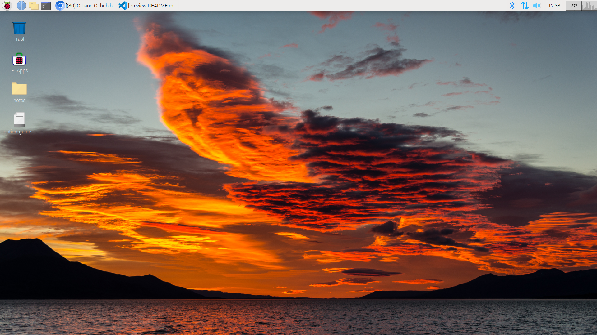

<!--markdown tutorial-->

Kaoser Alam<br/>
This is second line

age:17  
Izroth

---

# Kaoser Alam

## Kaoser Alam

### Kaoser Alam

#### Kaoser Alam

##### Kaoser Alam

###### Kaoser Alam

<br/>

### Pragraph
<p>This is kaoser alam.I am 17 years old and  I am  a noob programmer.<p>

<br/>

### Italic
_Tis is italik text_

<be/>

### Bold
__Tis is italik text__

<br/>

### Strikethorugh
~~This is~~

<br/>

### Single Line Code

`This is inline.`  

`<h1> Bangladesh <h1>`

<br/>

### Multiple LIne Code


```python

print("hello world")


```

```C

#include <stdio.h>
int main()

{
    printf("hello world!!");
    return 0;
}


```

<br/>

### Ordered List

1. Item1
2. Item2
    1. Item1.1
    2. Item1.2
3. Item2

<br/>

### Unordered List

- item1
  - item1.1
  - item1.2
- item2
- item3

<br/>

### Task List
- [x] task1
- [x] task2
- [x] task3

<br/>

### automatic link
http://www.studywithanis.com

### disable link
`http://www.studywithanis.com`

### markdown link syntex
[studywithanis](http://www.studywithanis.com)

[studywithanis][websitelink]

<br/>

### image syntax

<!---->


<br/>

###  emoji

😊😊😊😊😊😊😊😊
<!--emojipedia.org-->

<br/>

### table syntax

| name | email |
|------|-------|
|Kaoser|thisismyemail@gmail.com|
|Kaoser|thisismyemail@gmail.com|
|Kaoser|thisismyemail@gmail.com|


<!-- all link is here -->
[websitelink]: http://www.studywithanis.com


